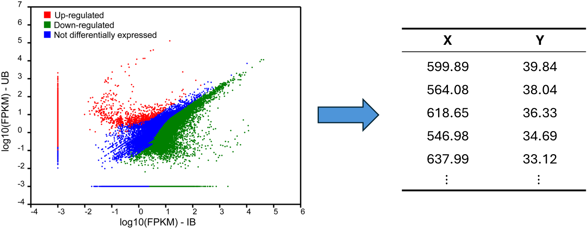

# PlotDigitizer 

 
	

A simple, powerful application that helps you digitize data from images.

 

 

## Install

Windows installers and portable versions (single .exe file) can be found in [releases page](https://github.com/alex1392/WpfPlotDigitizer/releases). Legacy Windows (XP, 7, 8) requires .NET 8.0 runtime installed.

Web version is available at [PlotDigitizer Web](https://plot-digitizer-g0embmcpc2deg5ah.francecentral-01.azurewebsites.net/).

There is currently no installer project in this repo (the legacy Visual Studio Installer Projects `.vdproj` was removed, since it can only be built from full Visual Studio with that extension installed). A future Windows installer should use the [WiX Toolset](https://wixtoolset.org/) instead, which ships a `dotnet`-buildable SDK-style project and produces a real `.msi` without requiring Visual Studio.

## Use cases

 

The data in journal articles or conference papers are usually published in the form of images, which creates a barrier for people who want to perform further statistical analysis. This application, Plot Digitizer, helps you extract data from any chart with ease, and includes advanced features such as OCR, editing, and filtering.

## Features

* **Auto detect chart axes**

	The program is able to detect the chart axes from the image automatically.
	You can also manually adjust the location of the axes.

	
 
	
	

* **Auto detect axis limits**

	Incorporate optical character recognition (OCR) to detect the axis limits and labels automatically. 
	You can also manually edit the axis limits and labels.
	Log-scale axis is supported as well.

	
 
	
	

* **Data filter by colors**

	Considering there may be multiple data types in different colors, it could be useful to filter out the data you don't need.

	

	
	

	

*  **Image editing**

	You can directly erase any noise or data you don't need.

	Currently the program supports the following functionalities:
	* Undo/redo function
	* Editting history
	* Pen tool 
	* Eraser tool
	* Rectangle selection tool
	* Polygon selection tool
	* Clear border function

	

	
	

* **Adaptive data**

	Supports digitizing both discrete data and continuous data.
	
    * Continuous data: suitable for line chart or clustered data.
	

	
	

	* Discrete data: suitable for isolated data points, the centroid of each data point is captured. 
	

	
	

* **Modern UX design**

	* Modern user interface

	* Fluent operating experience

	* Simple work flow

* **Load images with ease**

	Support multiple image loading methods, including:
	* Browse 
	* Copy & paste 
	* Drag & drop

	Support multiple image sources, including:
	* local image file
	* image metadata (from clipboard or microsoft office) 
	* online image (download from the image's Url address)

	
 
	
	

*  **Multiple export types**

	Supports export to a .csv or .txt file. The .csv file can be converted to .xlsx file by Excel.
    
## Tech

PlotDigitizer uses a number of open source projects:

   

## Author : C. Y. C.

License
----

MIT
